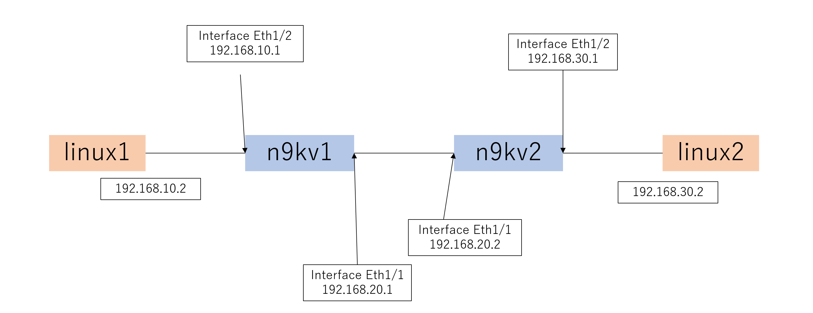

# netcon
## 問題文
>新入社員は既存の設定が入ったルータに新たなルータを接続し、ネットワークの勉強することにした。
>既存のルータ設定に合わせて、設定を行ったところ、 PC間で通信ができないようだ。
>各PC間で通信が通るように解決してほしい。
>ゴール
>linux2に対してlinux1からpingが到達すること。
>制限事項
>n9kv2の設定を削除することは禁止とする。
>linuxコンテナのインターフェイスに新たにipアドレスを追加しないこと。
